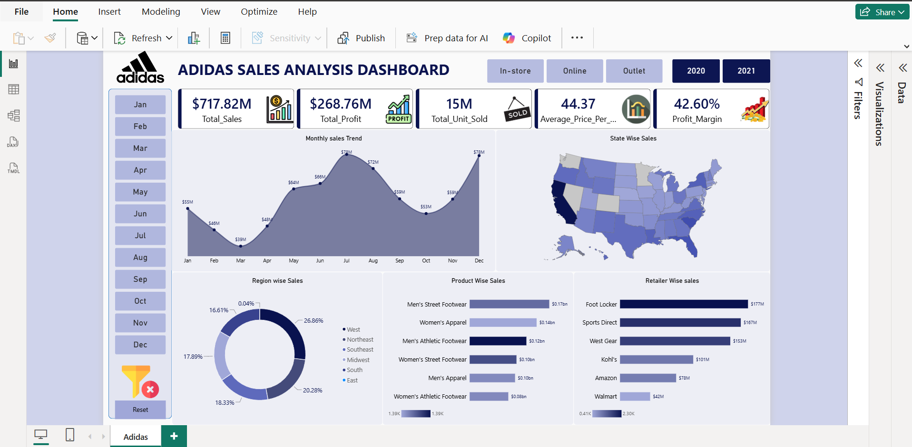

# Adidas Sales Analysis Dashboard – Power BI

## 📊 Project Overview

This project presents an interactive Adidas Sales Analysis Dashboard developed using Microsoft Power BI.

The dashboard analyzes sales performance across different years, months, regions, states, products, retailers, and sales channels.

## 🎯 Project Objective

The objective of this project is to analyze Adidas sales data and generate meaningful insights into:

- Sales performance
- Profit performance
- Product-wise sales
- Retailer-wise sales
- Region-wise sales
- State-wise sales
- Monthly sales trends
- Sales channel performance

## 🛠️ Tools & Technologies

- Microsoft Power BI
- Power Query
- DAX
- Microsoft Excel
- Data Visualization
- Data Analysis

## 📈 Key Performance Indicators

The dashboard includes the following KPIs:

- Total Sales
- Total Profit
- Total Units Sold
- Average Price per Unit
- Profit Margin

## 📊 Dashboard Visualizations

The dashboard contains:

- Monthly Sales Trend
- State-wise Sales Map
- Region-wise Sales
- Product-wise Sales
- Retailer-wise Sales
- Sales Channel Analysis
- Year and Month Filters

## 🖼️ Dashboard Preview

## 📁 Project Files

| File | Description |
|---|---|
| `Adidas_Sales_Analysis.pbix` | Power BI dashboard project |
| `Adidas US Sales_Datasets.xlsx` | Dataset used for analysis |
| `Problem_Statement.pptx` | Project problem statement and requirements |
| `Adidas_Dashboard.png` | Dashboard preview |

## 📌 Dashboard Highlights

The dashboard provides an interactive view of Adidas sales performance and allows users to explore the data using filters for years, months, and sales channels.

## 👨‍💻 Project

**Adidas Sales Analysis Dashboard**

Built using **Microsoft Power BI** for data analysis and visualization.
